# IIITB_Physical_Design_Using_ASIC_Class

## Table of Contents
- [Week - 1](#week---1)
    * [Day - 1 : Software Installation](#day---1--software-installation)
- [Week - 2](#week---2)
    * [Day - 1 : Introduction to Verilog RTL Design and Synthesis](#day---1--introduction-to-verilog-rtl-design-and-synthesis)
	* [Day - 2 : Timing libs, Hierarchical vs Flat Synthesis and Efficient flop coding styles](#day---2--timing-libs-hierarchical-vs-flat-synthesis-and-efficient-flop-coding-styles)
	* [Day - 3 : Combinational and Sequential Optimisations](#day---3--combinational-and-sequential-optimisations)
- [References](#references)

## Week - 1 
## Day - 1 : Software Installation

[Yosys Section]:#
### **YOSYS**
Yosys is a framework for Verilog RTL synthesis. It currently has extensive Verilog-2005 support and provides a basic set of synthesis algorithms for various application domains. Selected features and typical applications:

   1. Process almost any synthesizable Verilog-2005 design
   2. Converting Verilog to BLIF / EDIF/ BTOR / SMT-LIB / simple RTL Verilog / etc.
   3. Built-in formal methods for checking properties and equivalence
   4. Mapping to ASIC standard cell libraries (in Liberty File Format)
   5. Mapping to Xilinx 7-Series and Lattice iCE40 and ECP5 FPGAs
   6. Foundation and/or front-end for custom flows 

Yosys can be adapted to perform any synthesis job by combining the existing passes (algorithms) using synthesis scripts and adding additional passes as needed by extending the Yosys C++ code base. Yosys also serves as backend for several tools that use formal methods to reason about designs, such as sby for SMT-solver-based formal property checking or mcy for evaluating the quality of testbenches with mutation coverage metrics.
Yosys is free software licensed under the ISC license (a GPL compatible license that is similar in terms to the MIT license or the 2-clause BSD license). 

**Steps to install Yosys**

```
git clone https://github.com/YosysHQ/yosys.git
cd yosys 
sudo apt install make
sudo apt-get install build-essential clang bison flex \
    libreadline-dev gawk tcl-dev libffi-dev git \
    graphviz xdot pkg-config python3 libboost-system-dev \
    libboost-python-dev libboost-filesystem-dev zlib1g-dev
make config-gcc
make 
sudo make install
```
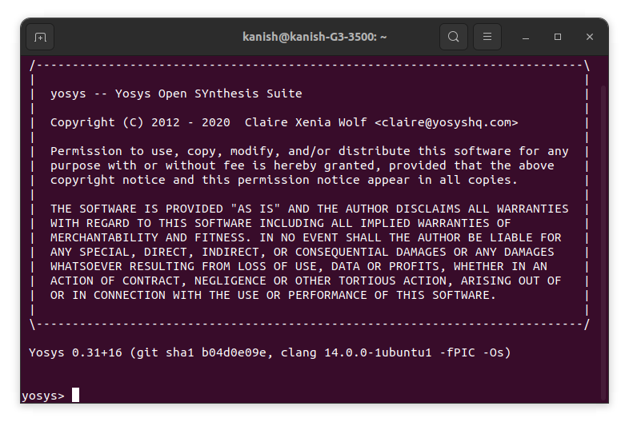    


[Icarus Verilog Section]:#
### **ICARUS VERILOG**
Icarus Verilog is an implementation of the Verilog hardware description language compiler that generates netlists in the desired format (EDIF). It supports the 1995, 2001 and 2005 versions of the standard, portions of SystemVerilog, and some extensions.Icarus Verilog is released under the GNU General Public License, Icarus Verilog is free software. Icarus is composed of a Verilog compiler (including a Verilog preprocessor) with support for plug-in backends, and a virtual machine that simulates the design.

**Steps to install Icarus Verilog**
```
sudo apt-get install iverilog
```
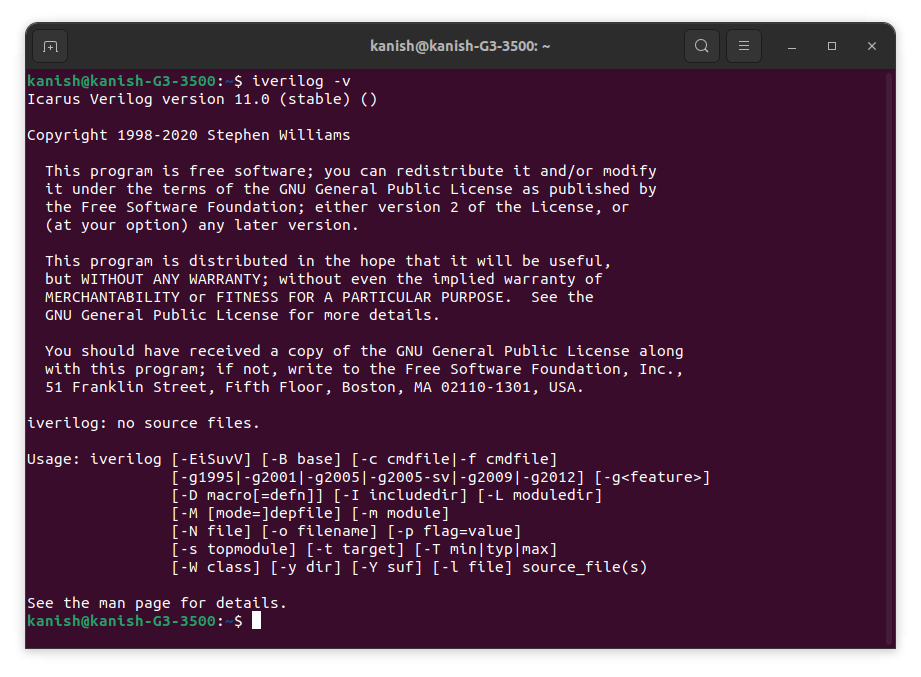


[GTKWave Section]:#
### **GTKWAVE**
GTKWave is a fully featured GTK+ based wave viewer for Unix and Win32 which reads LXT, LXT2, VZT, FST, and GHW files as well as standard Verilog VCD/EVCD files and allows their viewing.

**Steps to install GTKKwave**
```
sudo apt install gtkwave
```
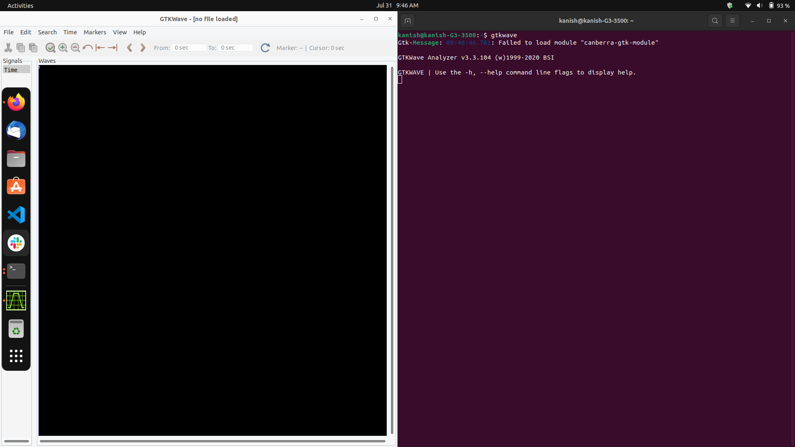


[Ngspice Section]:#
### **NGSPICE**
ngspice is the open source spice simulator for electric and electronic circuits comprising of JFETs, bipolar and MOS transistors, passive elements like R, L, or C, diodes, transmission lines and other devices, all interconnected in a netlist. Digital circuits are simulated as well, event driven and fast, from single gates to complex circuits. And you may enter the combination of both analog and digital as a mixed-signal circuit. ngspice offers a wealth of device models for active, passive, analog, and digital elements. Model parameters are provided by our collections, by the semiconductor device manufacturers, or from semiconductor foundries. The user can add their circuits as a netlist, and the output is one or more graphs of currents, voltages and other electrical quantities or is saved in a data file.

**Steps to install ngspice**</br>
Download the tarball from ***https://sourceforge.net/projects/ngspice/files/*** to a local directory and then follow the commands given below :
```
# Dependency for ngspice:
sudo apt-get install build-essential
sudo apt-get install libxaw7-dev

# ngspice installation:
tar -zxvf ngspice-40.tar.gz
cd ngspice-40
mkdir release
cd release
../configure  --with-x --with-readline=yes --disable-debug
make
sudo make install

```


[OpenSTA Section]: #
### **OPENSTA**
OpenSTA is a gate level static timing verifier. As a stand-alone executable it can be used to verify the timing of a design using standard file formats such as Verilog netlist, Liberty library, SDC timing constraints, SDF delay annotation and SPEF parasitics. OpenSTA uses a TCL command interpreter to read the design, specify timing constraints and print timing reports.

**Steps to install OpenSTA**</br>
Prior to the installation of the OpenSTA install the dependencies using the command shown below :</br>
``` 
sudo apt-get install cmake clang gcc tcl swig bison flex 
```

After installing the dependencies use the following command to install OpenSTA:
```
git clone https://github.com/The-OpenROAD-Project/OpenSTA.git
cd OpenSTA
mkdir build
cd build
cmake ..
make
sudo make install
```
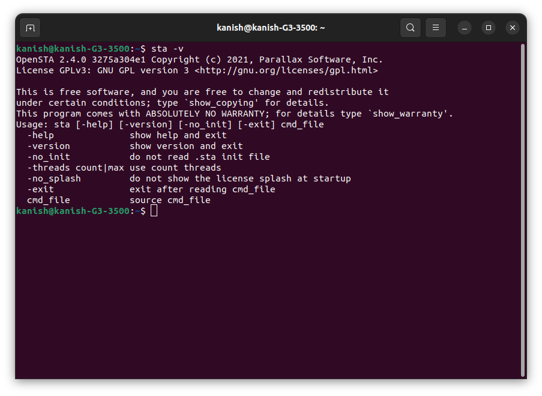


[Magic Section]:#
### **MAGIC**
Magic is an electronic design automation (EDA) layout tool for very-large-scale integration (VLSI) integrated circuit (IC) originally written by John Ousterhout and his graduate students at UC Berkeley. Work began on the project in February 1983. The main difference between Magic and other VLSI design tools is its use of "corner-stitched" geometry, in which all layout is represented as a stack of planes, and each plane consists entirely of "tiles" (rectangles). Magic is primarily famous for writing the scripting interpreter language Tcl.

**Steps to install magic**</br>
```
sudo apt-get install m4
sudo apt-get install tcsh
sudo apt-get install csh
sudo apt-get install libx11-dev
sudo apt-get install tcl-dev tk-dev
sudo apt-get install libcairo2-dev
sudo apt-get install mesa-common-dev libglu1-mesa-dev
sudo apt-get install libncurses-dev
git clone https://github.com/RTimothyEdwards/magic
cd magic
./configure
make
sudo make install
```
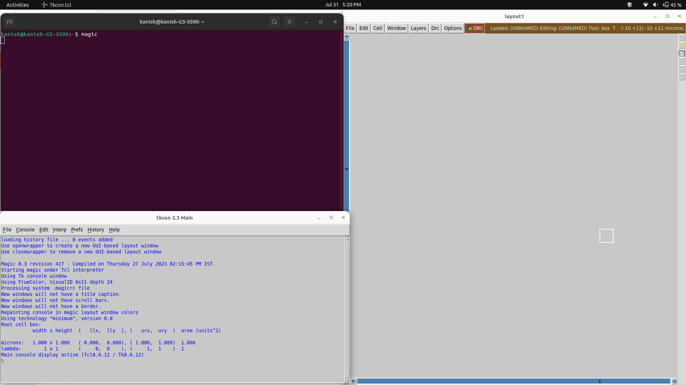


[OpenLane Section]:#
### **OPENLANE**
OpenLane is an automated RTL to GDSII flow based on several components including OpenROAD, Yosys, Magic, Netgen, CVC, SPEF-Extractor, KLayout and a number of custom scripts for design exploration and optimization. It also provides a number of custom scripts for design exploration and optimization. The flow performs all ASIC implementation steps from RTL all the way down to GDSII. Currently, it supports both A and B variants of the sky130 PDK, the C variant of the gf180mcu PDK, and instructions to add support for other (including proprietary) PDKs are documented. OpenLane abstracts the underlying open source utilities, and allows users to configure all their behavior with just a single configuration file.

Prior to the installation of the OpenLane install the dependencies and packages using the command shown below :</br>
``` 
sudo apt-get update
sudo apt-get upgrade
sudo apt install -y build-essential python3 python3-venv python3-pip make git
```
Docker Installation :</br>
```
sudo apt install apt-transport-https ca-certificates curl software-properties-common
curl -fsSL https://download.docker.com/linux/ubuntu/gpg | sudo gpg --dearmor -o /usr/share/keyrings/docker-archive-keyring.gpg

echo "deb [arch=amd64 signed-by=/usr/share/keyrings/docker-archive-keyring.gpg] https://download.docker.com/linux/ubuntu $(lsb_release -cs) stable" | sudo tee /etc/apt/sources.list.d/docker.list > /dev/null

sudo apt update
sudo apt install docker-ce docker-ce-cli containerd.io
sudo docker run hello-world

sudo groupadd docker
sudo usermod -aG docker $USER
sudo reboot 


# Check for installation
sudo docker run hello-world
```

**Steps to install OpenLane, PDKs and Tools**</br>
```
cd $HOME
git clone https://github.com/The-OpenROAD-Project/OpenLane
cd OpenLane
make
make test
```


## Week - 2
## Day - 1 : Introduction to Verilog RTL Design and Synthesis

### **Introduction to Simulator**
A simulator is a software tool that can be used to check the functionality of a circuit design before it is implemented in hardware. It does this by simulating the behavior of the design in software, using a Hardware Description Language (HDL) such as Verilog or VHDL. The Register Tranfer Level (RTL) design is the actual Verilog code that implements the circuit i.e., the behavioural representation of the specification in a HDL language. To verify the correctness of the RTL design with the specification, a testbench is written in HDL and simulated using the open-source simulator, Icarus Verilog. The testbench generates stimulus signals that are applied to the RTL design, and the simulator monitors the output signals to ensure that they are correct. The simulator monitors changes in the input signals. When an input signal changes, the simulator re-evaluates the RTL design and updates the output signals. The simulator records the changes in the input and output signals in a file called a Value Change Dump (VCD) file. This file is used to visualize the behavior of the design over time in the form of waveforms. A tool called GTKWave is used to open the VCD file and view the which helps in debugging the design and verifying its functionality in accordance with the specification.

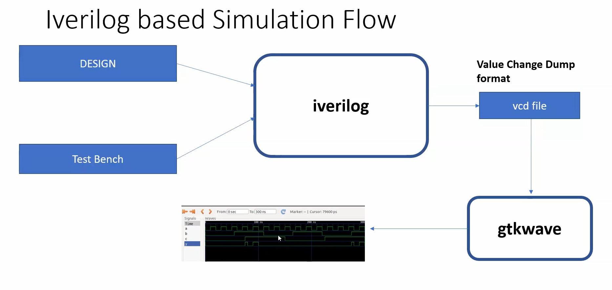

**Steps to download the lab folder**</br>
```
mkdir ASIC
cd ASIC
git clone https://github.com/kunalg123/vsdflow.git
git clone https://github.com/kunalg123/sky130RTLDesignAndSynthesisWorkshop.git
```

Command to view the folder structure of the lab, and list the contents of the directory:
```
cd ASIC/sky130RTLDesignAndSynthesisWorkshop/
ls -l
```


The lib folder contains all the library files needed for the lab, including the sky130 standard cell library. The verilog_model folder in ***/home/kanish/ASIC/sky130RTLDesignAndSynthesisWorkshop/my_lib*** contains the verilog models of the standard cells present in the .lib file. The verilog_files folder contains all the lab experiment verilog source files and corresponding testbench files needed to simulate the designs.

---

**Standard cell library** - It is a collection of well defined and appropriately characterized logic gates that can be used to implement a digital design. Timing data of standard cells is provided in the Liberty format.

The lib directory contains the library file **sky130_fd_sc_hd__tt_025C_1v80.lib**. Libraries in the SKY130 PDK are named using the following scheme:</br>
***<Process_name>_<Library_Source_Abbreviation>_<Library_type_abbreviation>[_<Library_name]***</br>

sky130 - Process Technology of the PDK sky130</br>
fd - SkyWater Foundry</br>
sc - Digital standard cells</br>
hd - High density</br>
tt - Typical Timing</br>
025C - 25 degree celsius Temperature</br>
1v80 - 1.8V Supply Voltage</br>

---

### **Demostration of the Icarus Verilog and GTKWave**
Change the current working directory to the directory containing the Verilog files using the following command :
```
cd /home/kanish/ASIC/sky130RTLDesignAndSynthesisWorkshop/verilog_files
```
Simulate the RTL design and testbench using the following command:
```
iverilog good_mux.v tb_good_mux.v 

``` 
The above command will compile and check for the syntax errors in both the design and testbench. Upon compiling successfully it will generate an executable file ***a.out***.</br>

Execute the a.out using the command **```./a.out ```**, resulting in the generation of a tb_good_mux.vcd file that captures changes in the input and output values.
This vcd file is given as the input to the GTKWave to view the wave form.
In GTKWave drag and drop the required input and output signals to view the waveform. Since the simulation is done for long amount of time use the zoom to fit option to view the entire waveform.

Commands to execute to view the waveform :
```
./a.out
gtkwave tb_good_mux.vcd
```

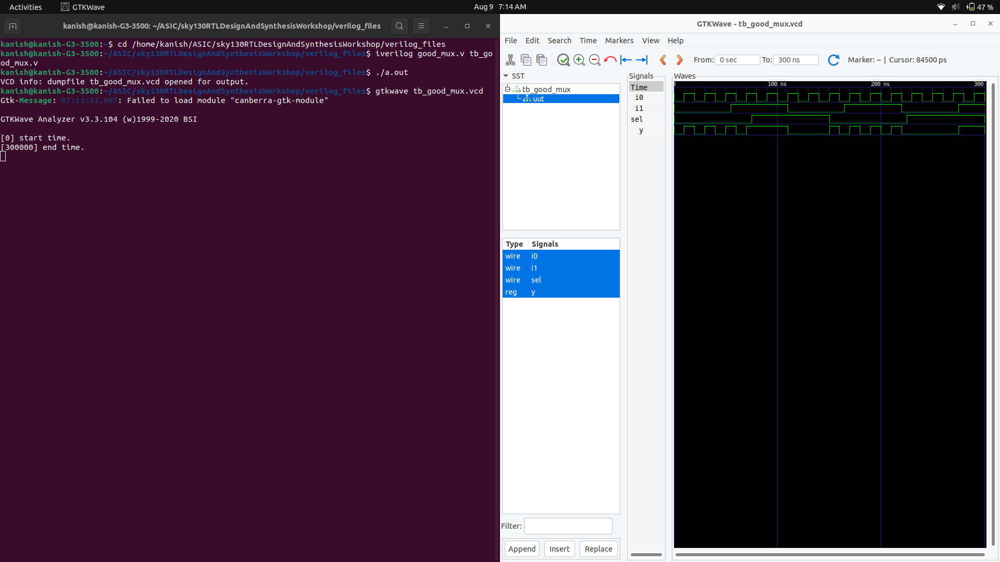


### **Description of the Verilog code**
To view the contents of the verilog files good_mux.v and tb_good_mux.v use the following command:
```
gvim -o good_mux.v tb_good_mux.v # -o is to open multiple windows at a time.
```
The verilog code of the good_mux.v is given below:
```
// Verilog Code for 2:1 Mux

/*
All verilog code starts with module, ends with endmodule and within them the logic is written. 
For RTL design portlist should be mentioned in the module and it should have atleast one input port and one output port.
In this design there are two data input ports, one select line input port and one output port. 
*/

module good_mux (input i0 , input i1 , input sel , output reg y);
always @ (*) // Whenever any one of the input changes execute the code enclosed between begin ... end
begin
	if(sel) //If sel = 1 then output y follows i1 else output y follows i0 
		y <= i1;
	else 
		y <= i0;
end
endmodule
```

The verilog code for the tb_good_mux.v is given below:
```
`timescale 1ns / 1ps // defines the time units and time precision for simulation.
module tb_good_mux; // AS mentioned earlier testbench doesnot have input and output ports
	// Inputs
	reg i0,i1,sel;
	// Outputs
	wire y;

        // Instantiate the Unit Under Test (UUT)
	good_mux uut (
		.sel(sel),
		.i0(i0),
		.i1(i1),
		.y(y)
	);

	initial begin
	$dumpfile("tb_good_mux.vcd"); //This system task specifies the name of the VCD file where simulation waveform data will be written
	$dumpvars(0,tb_good_mux); //This system task is used to specify which signals within a module should be included in the VCD file for waveform dumping.
	// Initialize Inputs
	sel = 0;
	i0 = 0;
	i1 = 0;
	#300 $finish; //Terminate the simulation after 300ns
	end

always #75 sel = ~sel;  //Toggle the value of the select line after 75ns
always #10 i0 = ~i0;   //Toggle the value of the select line after 10ns
always #55 i1 = ~i1;  //Toggle the value of the select line after 55ns
endmodule

```

### **Introduction to Synthesizer**
Synthesis is the process that converts RTL into a technology-specific gate-level netlist, optimized for a set of pre-defined constraints.Synthesizer is a tool used to convert the RTL from the netlist. Yosys is one such open source synthesizer.  A netlist is a file that represents the gates and flip-flops required to implement the design in hardware and the ineterconnections between them which is a result of the synthesis process. Yosys is provided with both the design and its corresponding .lib file, and its task is to generate the netlist. The netlist generated is a depiction of the input design provided to Yosys, contructed using the standard cells available in the .lib file. To validate the synthesis output, the netlist is verified in a manner analogous to how  the RTL design is verified. This involves using the same testbench and stimulus set to confirm that the outcomes obtained from the netlist correspond to those acquired when using the RTL design. The block diagram representation of the yosys flow and the netlist verification is shown below:


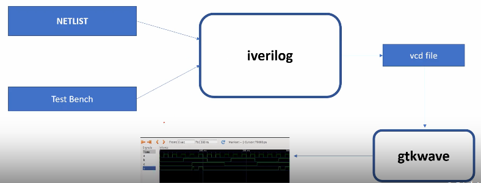


### **Liberty (.lib): Introduction**
The .lib file is a library of standard cells that can be used to implement any logic function. It includes different versions of the same standard cell, such as low speed, high speed etc., Why is there a necessity for various gate versions? The maximum speed of a digital circuit is determined by the combinational delay within its logic path. To achieve high circuit speed, particularly for high-frequency clock operation, a small Tcomb (combinational delay) is crucial. A higher frequency inherently results in high performance. However, if only high performance is neede, faster cells would appear to suffice, raising the question of why medium and slower cell options are necessary. The requirement for slower cells is to address hold time issues. In digital logic circuits, the load takes the form of capacitance. Faster charging and discharging induce minimal delays. Propagation delay, a key concept, refers to the time it takes for a change in the input of a digital logic gate or circuit to result in a corresponding change in its output. It is the duration between when the input transition begins and when the output transition completes. For larger capacitance (C), slow driving occurs, while smaller capacitance results in swift driving. For rapid charging and discharging of capacitance, a greater current sourcing capability is required. However, this leads to broader transistors, resulting in the increase in  area usage and higher power consumption. Narrower transistors offer reduced area usage and lower power consumption. The swiftness of cells brings with it the trade-off of area utilization and power consumption.


It is necessary to provide information for the synthesis toolregarding the choice of cells. Overuse of faster cells increases area and power demands, while also it leads to hold time violations. Conversely, excessive use of slower cells results in poor performance requirements. The optimal cell selection for the synthesizer is guided by constraints that dictate the appropriate cell set to use.

### **Setup Time and Hold Time**

### **Yosys Illustration**
**Step 1:** Change the current working directory to the directory containing the Verilog files using the following command :
```
cd /home/kanish/ASIC/sky130RTLDesignAndSynthesisWorkshop/verilog_files
```

**Step 2:** Invoke the yosys 
```
yosys
```

**Step 3:** Read the liberty file 
```
read_liberty -lib /home/kanish/ASIC/sky130RTLDesignAndSynthesisWorkshop/lib/sky130_fd_sc_hd__tt_025C_1v80.lib 
```


**Step 4:** Read the verilog design file
```
read_verilog good_mux.v 
```

---

**read_liberty** - Read cells from liberty file as modules into current design. The ***-lib*** switch creates empty blackbox modules.</br>
**read_verilog** - Loads modules from  verilog file to the current design.

---

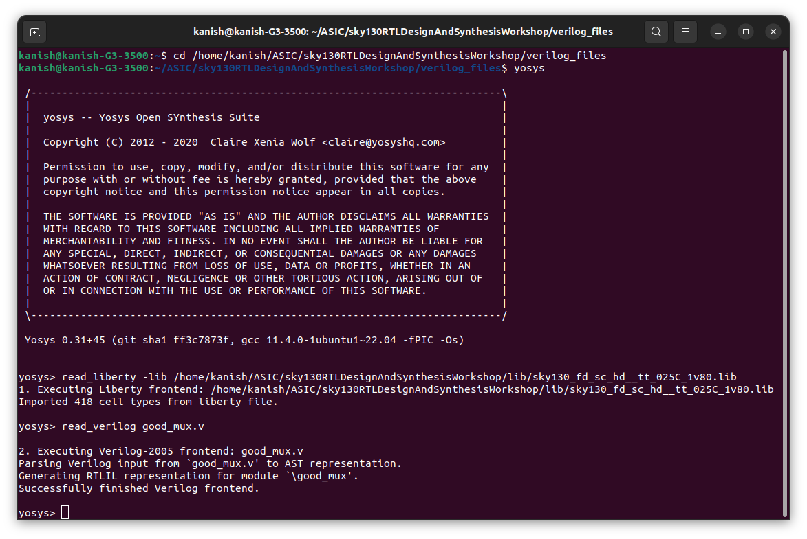


**Step 5:** Synthesize the verilog file.
```
synth -top good_mux
```

___
**synth** - command runs the default synthesis script. The ***-top*** switch use the specified module as top module.
___


The output of the synthesis displays the number of wires used , number of standard cells used and the name of the standard cell. 


**Step 6:** Generate the netlist
```
abc -liberty /home/kanish/ASIC/sky130RTLDesignAndSynthesisWorkshop/lib/sky130_fd_sc_hd__tt_025C_1v80.lib
```

___
**abc** -  This command uses the ABC tool for technology mapping of yosys's internal gate library to a target architecture. The ***-lib*** switch liberty <file>
generate netlists for the specified cell library using the liberty file format.
___

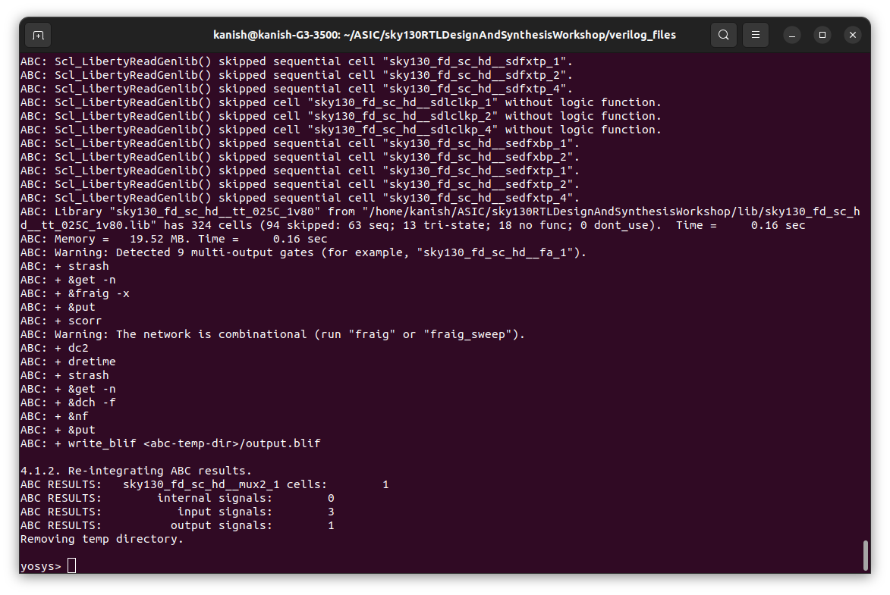

The output of the synthesis displays the number of input and output signals and the name of the standard cell that is used. 


**Step 7:** View the netlist
```
show
```

___
**show** - Creates a graphviz DOT file for the selected part of the design and compile it to a graphics file. It generates a schematic.
___


In the schematic there is sky130 based 2:1 multiplexer standard cell with three inputs and one output.


**Step 8:** Write the netlist
```
write_verilog -noattr good_mux_netlist.v
```
___
**write_verilog** - Writes the current design to a Verilog file. The ***-noattr** switch skips the attributes from included in the output netlist.
___

The netlist and the write_verilog command is shown below:


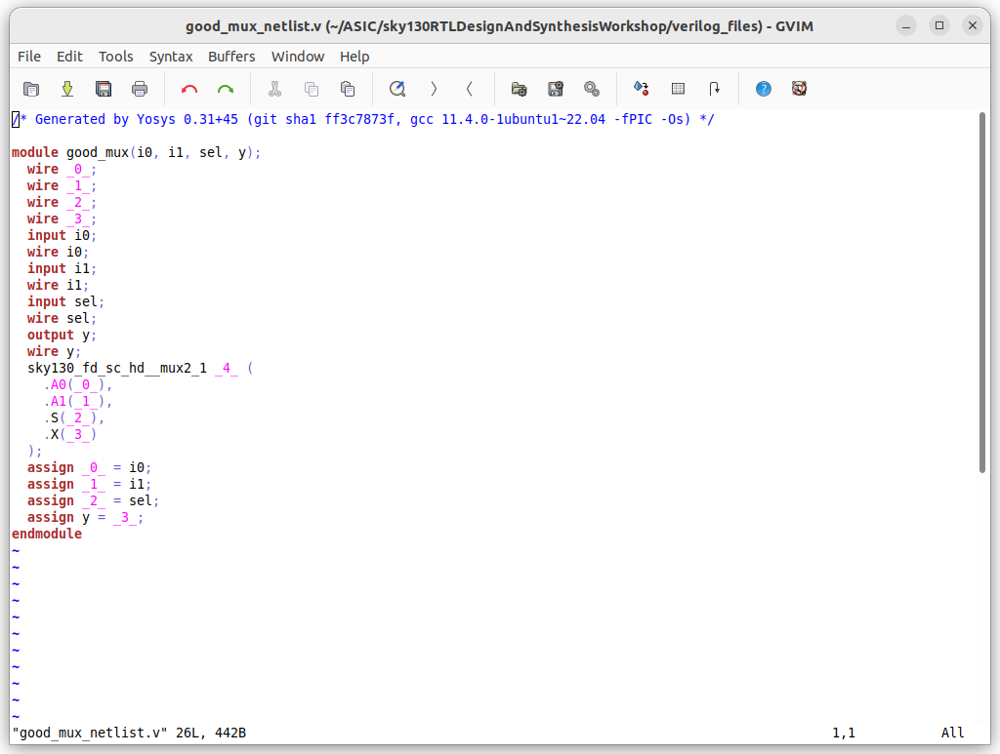


## Day - 2 : Timing libs, Hierarchical vs Flat Synthesis and Efficient flop coding styles
### **Exploring the Contents of .lib File**
To view the contents inside the .lib file type the following command :
```
cd ASIC/sky130RTLDesignAndSynthesisWorkshop/lib/
gvim sky130_fd_sc_hd__tt_025C_1v80.lib
```
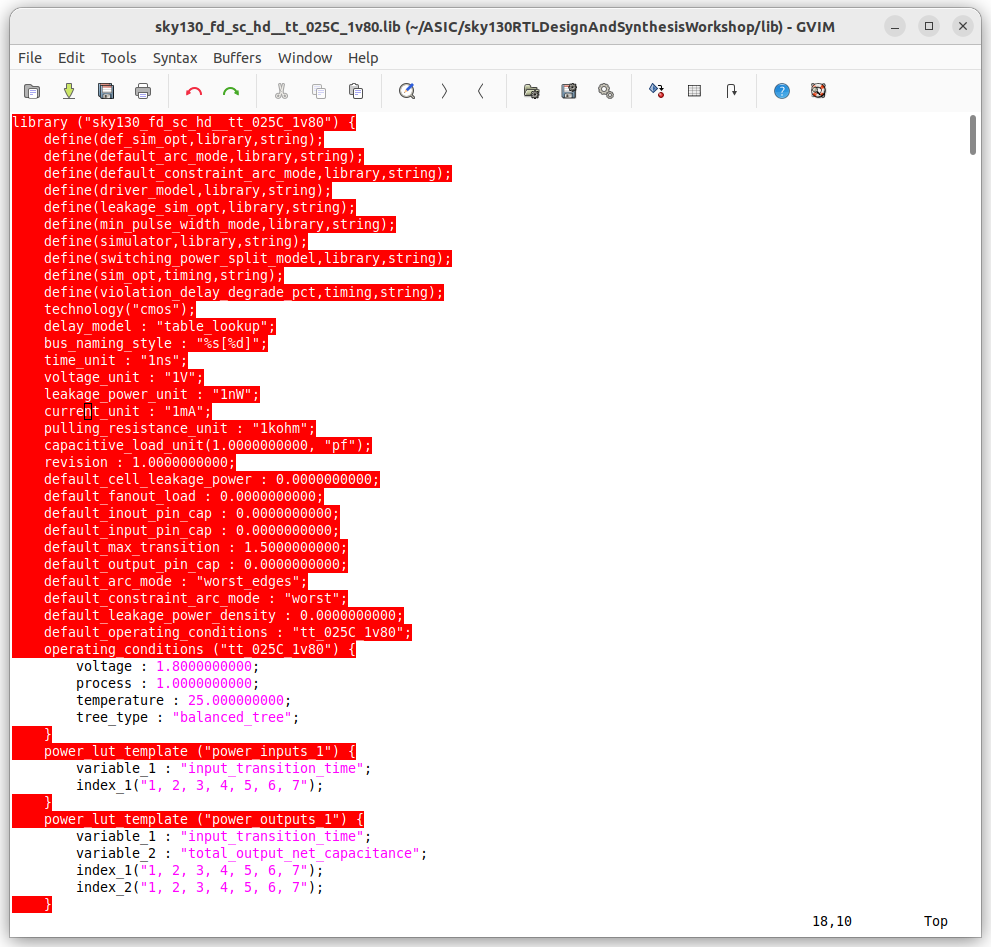

One of the fundamental parameter stored within .lib files comprises PVT parameters, where P signifies Process, V represents Voltage, and T denotes Temperature. 
The variations in these parameters can cause significant changes in the performance of circuits.

1. Process Variation: During the manufacturing process, there may be some deviations in the transistor characteristics, causing non-uniformity across the semiconductor wafer. Critical parameters like oxide thickness, dopant concentration, and transistor dimensions experience alterations.

2. Voltage Variation: Voltage regulators might exhibit variability in their output voltage over time, inducing fluctuations in current and impacting the operational speed of circuits. 

3. Temperature Variation: The functionality of a semiconductor device is sensitive to changes in temperature, particularly at the internal junctions of the chip. 

Further it contains the technology that is used is CMOS for which delay are modelled  through table lookup. This file also defines the units for parameters like voltage, power, current, capacitance, and resistance. Within the .lib library, each standard cell consists a  set of parameters specific to that cell's features.

Consider the a2111oi gate whose parameters and verilog files is shown below:

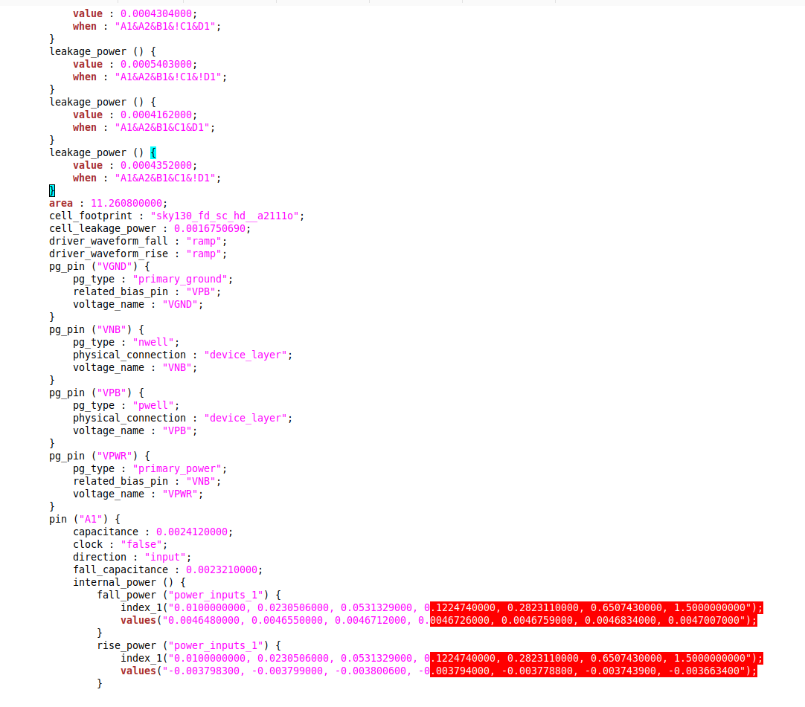
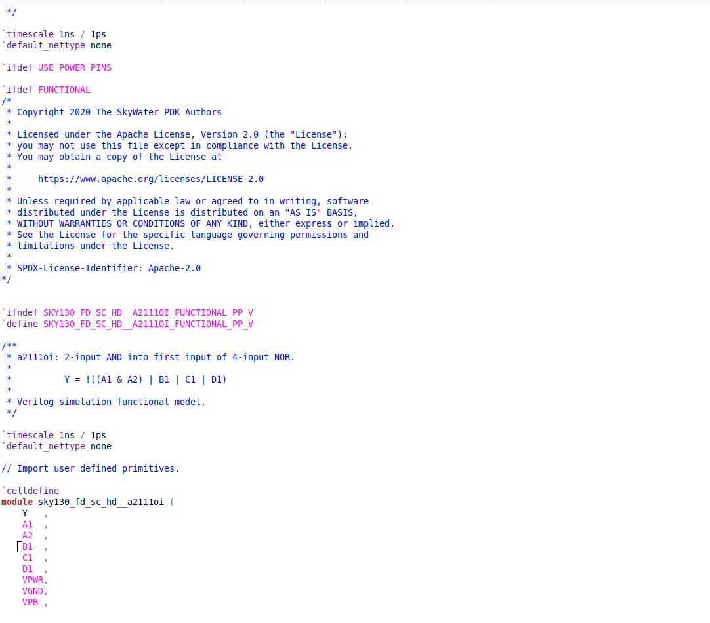

This is a 2-input AND gate and a 4-input NOR gate. Within the .lib file, sevetral parameters specific to this particular standard cell is given, including leakage power values for every possible input combination, specifications regarding pin type and pin capacitances, internal power metrics, timing-related particulars, as well as area measurements and power-related specifics for the standard cells. Similarly for all the standard cells the parameters above mentioned is listed in the .lib file.

Consider the different versions of the same logic gate shown below:
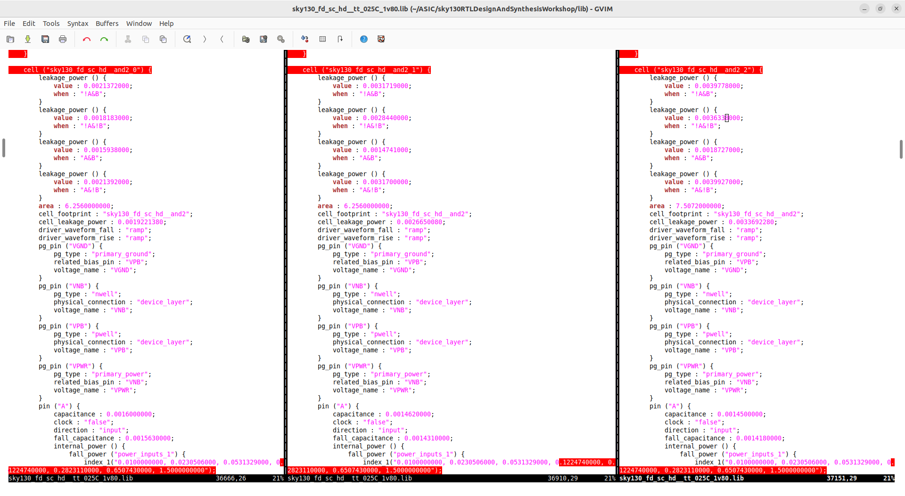

In all the three the logic inferred is same bu the area is different. Wider cells consume more power but delay wise it is less. The leakage power in the wider cell is more compared to the narrow cell which is depicted in the image .

### **Hiererchical Synthesis and Flat Synthesis**
Hierarchical synthesis is breaking a comples modules into smaller, more manageable sub-modules or blocks. Each of these sub-modules can be synthesized or designed independently before being integrated into the larger system. This approach allows for efficient design, optimization, and verification of individual components while maintaining a structured and organized design process. An illustration of the hierarchical synthesis is shown below :

Consider the verilog file multiple module which is given in the verilog_files directory

 ```
module sub_module2 (input a, input b, output y);
	assign y = a | b;
endmodule

module sub_module1 (input a, input b, output y);
	assign y = a&b;
endmodule


module multiple_modules (input a, input b, input c , output y);
	wire net1;
	sub_module1 u1(.a(a),.b(b),.y(net1));  //net1 = a&b
	sub_module2 u2(.a(net1),.b(c),.y(y));  //y = net1|c ,ie y = a&b + c;
endmodule
 ```

 In this case the module multiple_modules iinstantiates two sub_modules where the sub_module1 implements the AND gate and sub_module2 implemets the OR gate which are integrated in the multiple_modules.  Synthesis the multiple module using the sollowing commands:
 ```
 cd /home/kanish/ASIC/sky130RTLDesignAndSynthesisWorkshop/verilog_files
 yosys
 read_liberty -lib ../lib/sky130_fd_sc_hd__tt_025C_1v80.lib 
 read_verilog 
 read_verilog multiple_modules.v 
 synth -top multiple_modules
 abc -liberty ../lib/sky130_fd_sc_hd__tt_025C_1v80.lib 
 show multiple_modules
 write_verilog multiple_modules_hier.v
 ``` 
 ___
 **Note:**</br>
 When using hierarchical design instead of enetering the ***show*** command to view the file ***show <module_name>*** must be otherwise yosys will generate the following error : "ERROR: For formats different than 'ps' or 'dot' only one module must be selected."
 ___

 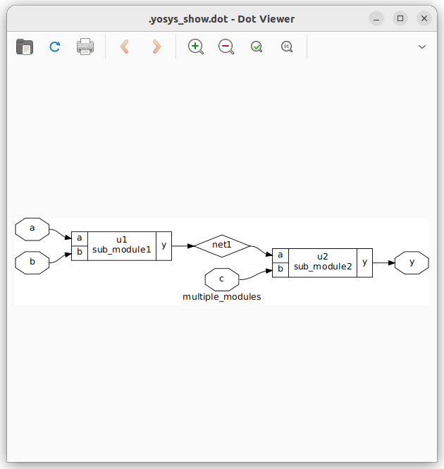
 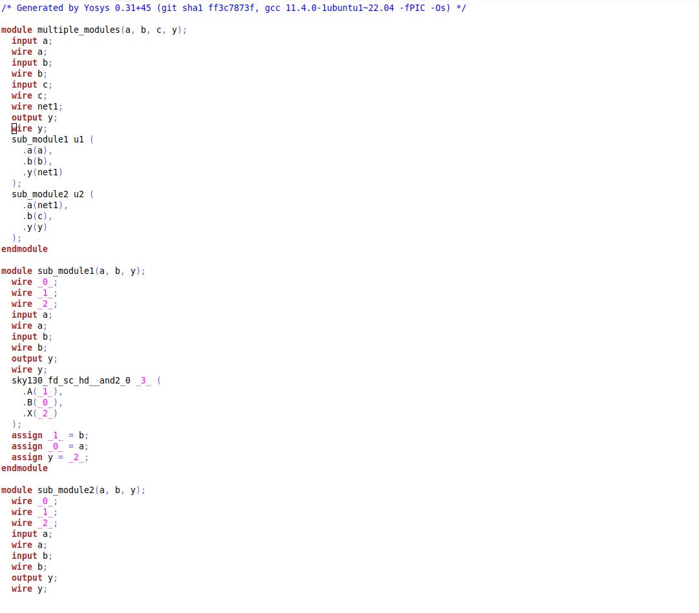
 
 Yosys does not show the AND gate and OR gate in the synthesis instead it shows the submodule names. The netlist also contains the AND and OR logic in separate submodules. Some times yosys may optimize the design such that the OR gate will be created using NAND gates. It is because the CMOS structure of the OR gate which is shown below has two pmos transistors stacked together. The mobility of the holes is less than the mobility of the electrons , since mosfets are majority carrier devices and majority carrier of the pmos is holes it increases the delay hence it becomes a bad circuit. In NAND gate implementation only the nmos are stacked.
 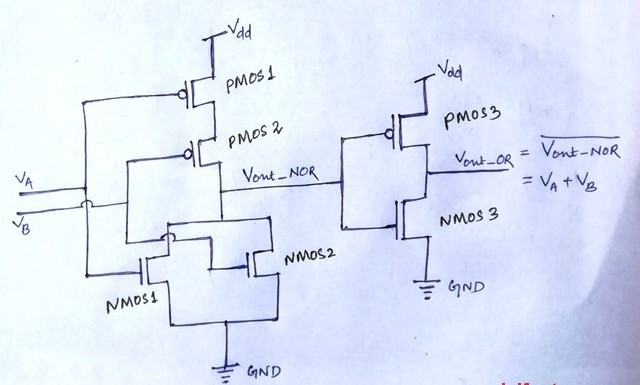

Flattening the hierarchy means simplifying the hierarchical structure of a design by collapsing or merging lower-level modules or blocks into a single, unified representation. In yosys the flattening can be done with ***flat*** command. Yosys illustration of flattening the hiererchy.

```
 cd /home/kanish/ASIC/sky130RTLDesignAndSynthesisWorkshop/verilog_files
 yosys
 read_liberty -lib ../lib/sky130_fd_sc_hd__tt_025C_1v80.lib 
 read_verilog 
 read_verilog multiple_modules.v 
 synth -top multiple_modules
 abc -liberty ../lib/sky130_fd_sc_hd__tt_025C_1v80.lib 
 flatten
 show
 write_verilog multiple_modules_flat.v
```
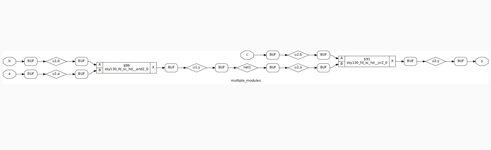


The flatten command breaks the hierarchy and makes the design into a single module by creating AND and OR gates for the logics inferred by the submodule which is shown in the images above.

### **Synthesising a Submodule :**
Suppose a multiplier design needs to be used in numerous instances. Rather than undergoing synthesis six times independently, the preferred approach is to synthesize it once and then duplicate it within the primary module. Using module-level synthesis becomes advantageous when dealing with multiple occurrences of identical modules. Another reason for synthesizing submodule is to follow the principle of divide and conque for extensive designs that may not be optimized effectively, synthesizing the design module by module ensures that each module is effectively optimized.

**Steps to synthesis submodule :**

```
cd /home/kanish/ASIC/sky130RTLDesignAndSynthesisWorkshop/verilog_files
yosys
read_liberty -lib ../lib/sky130_fd_sc_hd__tt_025C_1v80.lib 
read_verilog multiple_modules.v 
synth -top sub_module
abc -liberty ../lib/sky130_fd_sc_hd__tt_025C_1v80.lib 
show
```
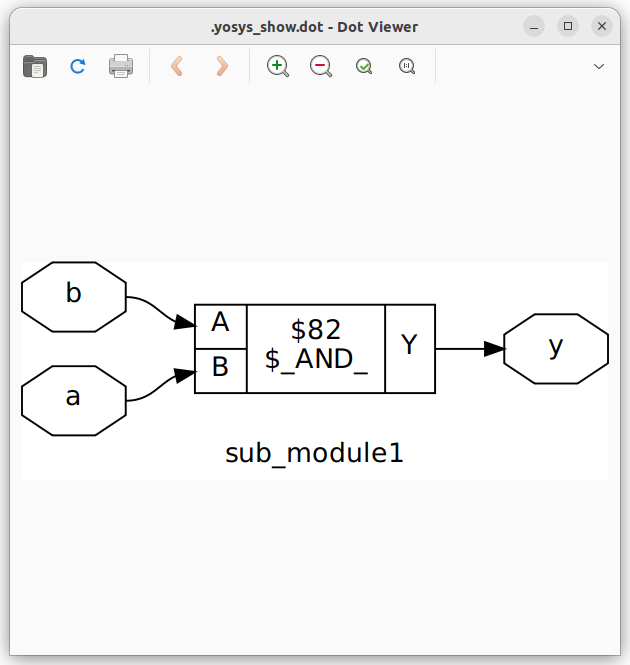


### **Flip-FLops**
A flip-flop is a fundamental sequential synchronous electronic circuit that is capable of storing information. A single flip-flop can store 1- bit of information and several flip-flops can be grouped together to form registers and memory that can store multiple bits of information. There are several types of flip-flops like JK flip-flop, D flip-flop, T flip-flop and SR flip-flop but D flip-flop is widely and most commanly used since it transmits the input data to the output without performing any modifications. A D flop-flop needs two inputs : data and clock. The flip-flop can be positive-edge triggered or negative-edge triggered i.e, the output makes transition during the rising edge of the clock pulse if it is positive-edge triggered and if the output makes transition during the falling edge of the clock pulse then it is said to be negative- edge triggered.

### **Need of flip-flops**</br>
In any electronic circuit there will always be an propagation delay. These delays may cause glitches in the output which may cause the output state to change when it is not supposed to. Glitches are unwanted transitions in the output. As an illustration consider the circuit shown below:


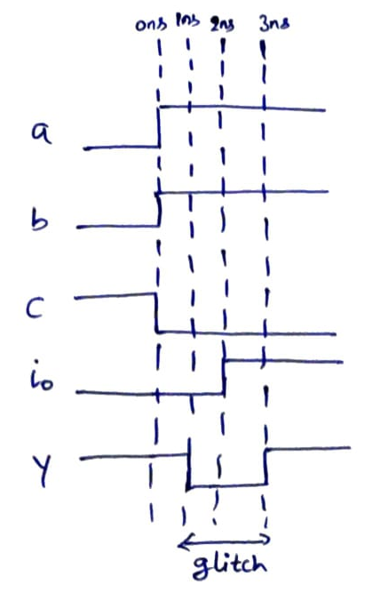

The propagation delay of the OR gate is 1ns and AND gate is 2ns. Initially a,b,c are 0,0,1 and the internal node i0 is 0 and the output Y is high. At t=0ns there is change in the inputs a,b,c becomes 1,1,0. Because of the propagation delays of the AND gate and OR gate at t=1ns the output node transits from high to low and since the input to the OR gate both i0 and c are 0. At t=2ns the internal node i0 transists from 0 to 1 and  the inputs to the OR gate becomes 1 and 0. Since the propagation delay of the OR gate is 1ns the output Y becomes high at 3ns and remains stable. Between 1ns and 3ns the output made an unwanted change in the transition resulting in a glitch.  

In order to avoid the glitches a D flip-flop can be connected at the output so that the output will change only at the rising or falling edge of the clock. As mentioned earlier flip-flops generally needs two inputs: data and clock. But the problem is the initial state of the flip-flop is unknown. So in order to set the initial value of the flip-flop, two more inputs are provided : preset/set and reset. These additional inputs can be synchronous with clock or asynchronous with clock.

**Steps to simulate and generate the netlist for the below designs**

Simulation steps :
```
iverilog <rtl_name.v> <tb_name.v>
./a.out
gtkwave <dump_file_name.vcd>
```

Generating netlist steps :
```
yosys
read_liberty -lib ../lib/sky130_fd_sc_hd__tt_025C_1v80.lib  
read_verilog <module_name.v> 
synth -top <top_module_name>
dfflibmap -liberty ../lib/sky130_fd_sc_hd__tt_025C_1v80.lib 
abc -liberty ../lib/sky130_fd_sc_hd__tt_025C_1v80.lib 
show
write_verilog -noattr <netlist_name.v>
```

___
***Note***:</br>
**dfflibmap** - technology mapping of flip-flops</br>
dfflibmap  -liberty - Maps internal flip-flop cells to the flip-flop cells in the technology library specified in the given liberty file.

Generally in the flow there will be a separate .lib file for the flip-flops which needs to be used with the dfflibmap command.
___

### **Illustration of Different types of Flip-flop** 
**1. D flip-flop with Synchronous reset**</br>
A D flip-flop with synchronous reset  combines the functionality of a D flip-flop with the ability to reset its state synchronously. This means that the flip-flop's stored value can be reset to 0 or low state based on a clock signal and a reset input, ensuring that the reset operation occurs when the clock signal transits.
The verilog code, simulation and synthesis results are shown below:
```
module dff_syncres ( input clk , input async_reset , input sync_reset , input d , output reg q );
always @ (posedge clk )
begin
	if (sync_reset)
		q <= 1'b0;
	else	
		q <= d;
end
endmodule
```


**2. D flip-flop with Asynchronous reset**</br>
A D flip-flop with asynchronous reset combines the functionality of a D flip-flop with the ability to reset its state asynchronously. This means that the flip-flop's stored value can be reset to 0 or low state regardless of the clock signal's state.
The verilog code, simulation and synthesis results are shown below:
```
module dff_asyncres ( input clk ,  input async_reset , input d , output reg q );
always @ (posedge clk , posedge async_reset)
begin
	if(async_reset)
		q <= 1'b0;
	else	
		q <= d;
end
endmodule
```


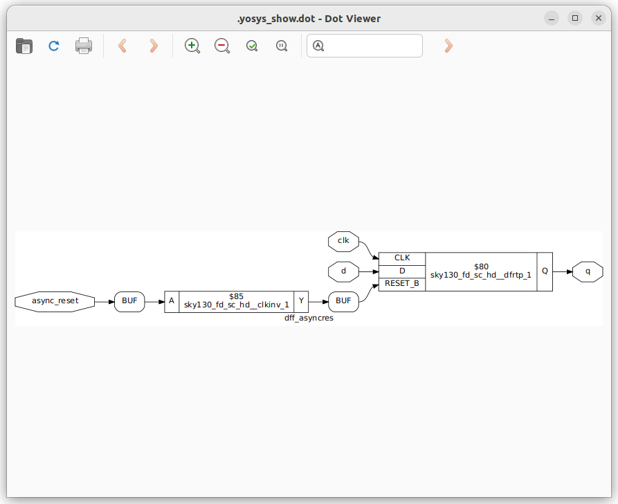

**3. D flip-flop with Asynchronous set**</br>
A D flip-flop with asynchronous set combines the functionality of a D flip-flop with the ability to set its state asynchronously. This means that the flip-flop's stored value can be set to 1 or high state regardless of the clock signal's state.
The verilog code, simulation and synthesis results are shown below:

```
module dff_async_set ( input clk ,  input async_set , input d , output reg q );
always @ (posedge clk , posedge async_set)
begin
	if(async_set)
		q <= 1'b1;
	else	
		q <= d;
end
endmodule
```


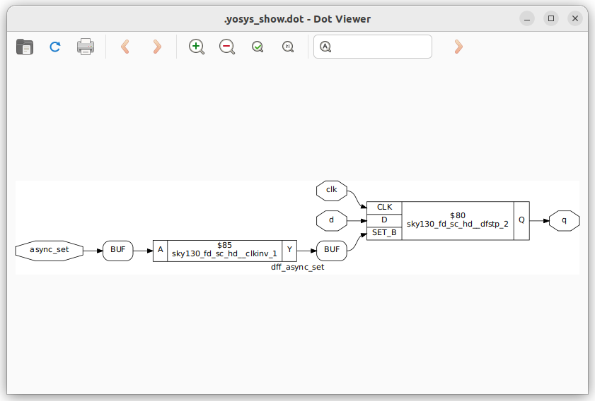


**4. D flip-flop with Asynchronous and Synchronous reset**</br>
A D flip-flop with both asynchronous and synchronous reset that combines the features of a D flip-flop with the ability to reset its state using either an asynchronous reset input or a synchronous reset input. This provides flexibility in resetting the flip-flop's state under different conditions.

The verilog code, simulation and synthesis results are shown below:

```
module dff_asyncres_syncres ( input clk , input async_reset , input sync_reset , input d , output reg q );
always @ (posedge clk , posedge async_reset)
begin
	if(async_reset)
		q <= 1'b0;
	else if (sync_reset)
		q <= 1'b0;
	else	
		q <= d;
end
endmodule
```


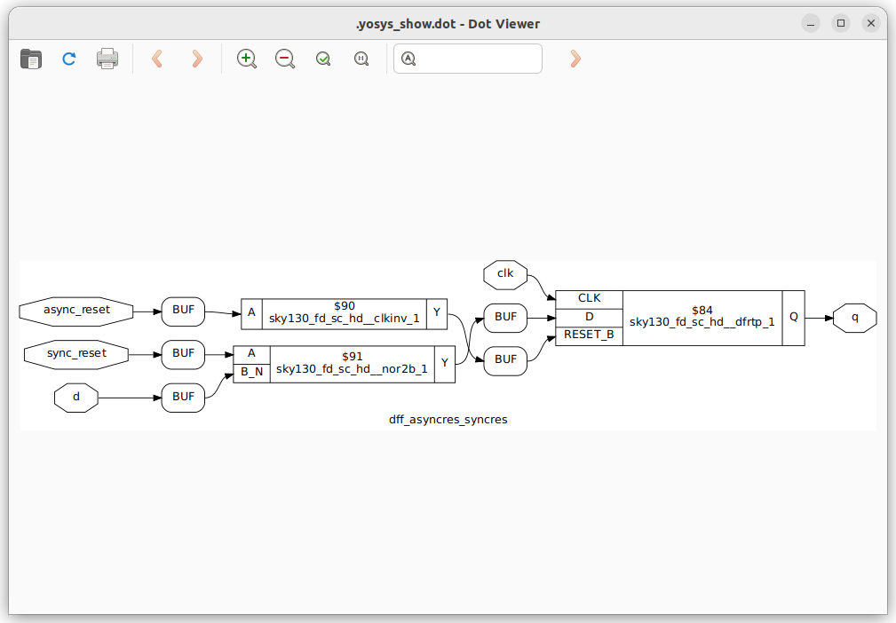


### **Optimizations**
During synthesis yosys will perform optimisations based on the logic that is being designed. An illustration of the yosys optimization is given below:

**1. Optimisation Example 1**

Consider the verilog design given below:
```
module mul2 (input [2:0] a, output [3:0] y);
	assign y = a * 2;
endmodule
```
This code performs multiplication of the input number by 2. Since the input is 3-bit binary number all the input and output combinations are as follows:
| a2 a1 a0  |y3 y2 y1 y0   |
|:---:|:---:|
| 0 0 0 | 0 0 0 0  |
| 0 0 1 | 0 0 1 0  |
| 0 1 0 | 0 1 0 0  |
| 0 1 1 | 0 1 1 0  |
| 1 0 0 | 1 0 0 0  |
| 1 0 1 | 1 0 1 0  |
| 1 1 0 | 1 1 0 0  |
| 1 1 1 | 1 1 1 0  |

y0 is always 0 and the code doesn't need any hardware and it only needs the proper wiring of the input bits to the output and grounding the bit y0. The netlist of the design is shown below:


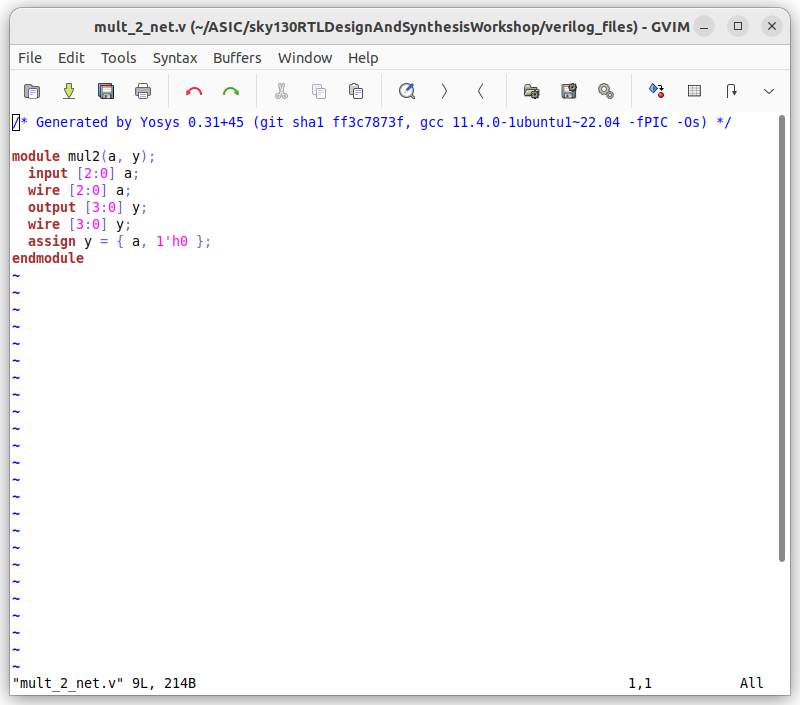

**2. Optimisation Example 2**

Consider the verilog design given below:
```
module mult8 (input [2:0] a , output [5:0] y);
	assign y = a * 9;
endmodule
```
In this design the 3-bit input number "a" is multiplied by 9 i.e.,(a*9) which can be re-written as (a\*8) + a . The term (a\*8) is nothing but a left shifting the number a by three bits. Consider that a = a2 a1 a0. (a\*8) results in a2 a1 a0 0 0 0. (a\*9)=(a\*8)+a = a2 a1 a0 a2 a1 a0 = aa(in 6 bit format). Hence in this case no hardware realization is required. The synthesized netlist of this design is shown below:

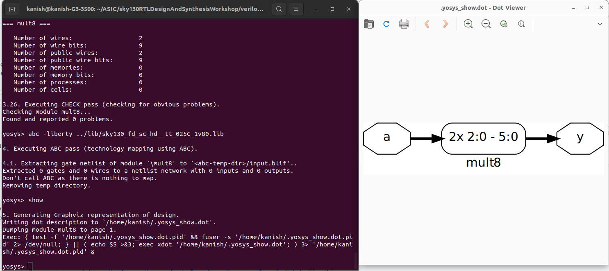


## Day - 3 : Combinational and Sequential Optimisations
### **Logic Optimisations**
In a broader context, Digital electronics encompasses two types of optimisations: Combinational and Sequential optimisations. These optimisations are done inorder to achieve designs that are efficient in terms of area, power, and performance.

### **Combinational Optimisations**
The techniques used for optimising the combinational Circuits are as follows:
1. Constant Propagation (Direct Optimisation)
2. Boolean Logic Optimisation (using K-Map or Quine McCluskey method)

#### **1. Constant Propagation Illustration**
Consider the combinational circuit shown below :

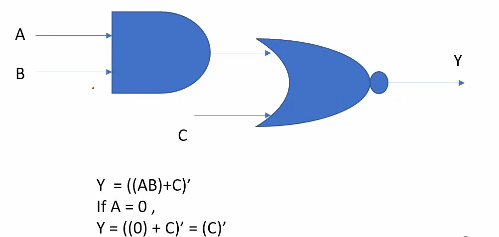

The boolean logic inferred is Y = ((AB)+C)'. If A is always tied to ground i.e., A = 0, then the expression will always evaluate to C'. In this case instead of having a AND gate and a NOR gate the circuit can be simplified by using a single NOT gate with C as its input. Even though both of then represent the same logic since the number of transistors used in the optimised design is less compared to that of the given circuit which shown in the above figure. The transistor level implementation of the given circuit and the optimised circuit is shown below :


The circuit that is given is implemented in NAND logic in order to prevent the stacking of the pmos. The transistor implementation clearly demonstrates a reduction in the required number of transistors for designing, decreasing from 12 to 2 in the optimised design. This will result in reduced power consumption and occuppies less area.

#### **2. Boolean Logic Optimisation Illustration**
Consider the verilog statement below : 
```
assign y = a?(b?c:(c?a:0)):(!c);
```
The ternary operator **(?:)** will realize a mux upon synthesis. The combinational circuit that corresponds to the above statement is shown below:


This circuit can be optimised by writing the equivalent expression (or function) in boolean variables and minimising the function that will result in more optimised design which is shown below:


### **Sequential Optimisations**
The sequential logic optimisations techniques are broadly classified into two categories :
1. Basic Techniques
	a. Sequential Constant Propagation
2. Advanced Techniques
	a. State Optimisation
	b. Retiming
	c. Sequential Logic Cloning (Floor aware Synthesis)

#### **1. Sequential Constant Propagation**
Consider the sequential circuit shown below :

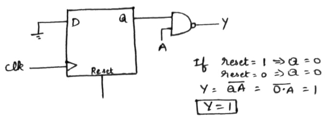

The D flip-flop shown in the figure is positive edge triggered with asynchronous reset and the data input D is always tied to the ground (i.e, low state or logic 0). When reset is applied the output of the flop becomes low and if reset it deasserted the output of the flop still remains low. Hence one of the input to the NAND gate is always low resulting in the output Y to be always in high stae (logic 1 or VDD). Hence the optimised version of this circuit is connecting the output port Y directly to VDD i.e., the supply voltage.

___
***Note***: </br>
Consider the circuit shown below :
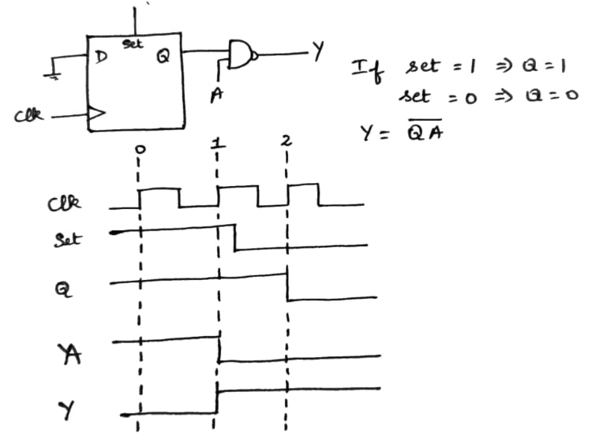

This circuit is similar to the one that is discussed above except that it doesn't have asynchronous reset instead it has asynchronous set. When the set input is logic 1 then output of the flop i.e., Q becomes high otherwise Q follows D input which is logic 0. This circuit can't be optimised like the previous circuit discussed in the above section. Consider the waveform between timestamp 1 and timestamp 2, the set pin is deasserted before the rising edge of the clock. The output Q remains high until the next rising edge even though the set input is deasseretd. The output of thr flop Q makes transition only at timestamp2. Therefore set input must be considered as Q'. This circuit can't be optimised.
___

#### **2. State Optimisation**
State optimization refers to the process of minimizing the number of unused states in a digital circuit's state machine.

#### **3. Sequential Logic Cloning**
Sequential logic cloning is used to replicate or clone a portion of a sequential logic circuit while maintaining its functionality and behavior. The goal is to exploit the benefits of parallelism and redundancy while ensuring that the cloned circuit produces identical outputs to the original circuit for the same inputs.
This technique is commonly employed in various scenarios such as redundancy for fault tolerance, speed improvement, and power optimization. This technique is generally used when a physical aware synthesis is done.

Consider the circuit shown below : 

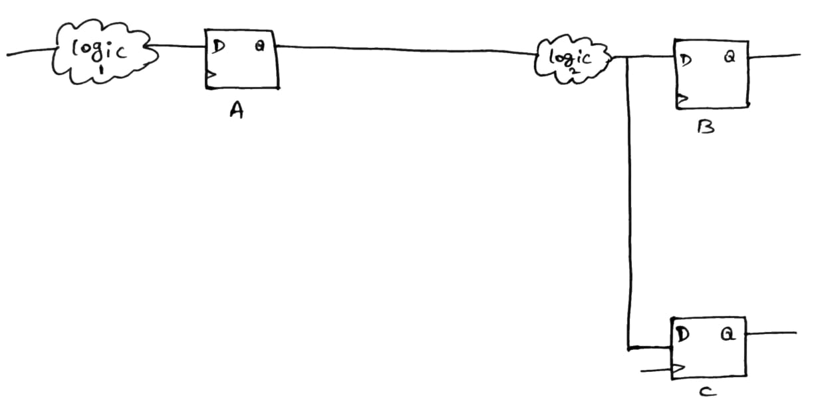

Consider flop A has large positive slack. The flops B and C are far from flop A. Hence there will be a large routing delay from A to B and A to C. To avoid this flop A and the combinational logic 2 is replicated  or cloned in the paths of B and C as shown in the figure below. Since flop A has large positive slack the delay introduced because of the cloning will be compensated and the further delay in the circuit is mainly depended on flop B and flop C.


#### **4. Retiming**
Retiming  used to improve the performance interms of better timing characteristics by repositioning the registers (flip-flops) within the circuit without altering its functionality. In a digital circuit, registers (flip-flops) are used to store intermediate results and control the flow of data. The placement of these registers can significantly impact the circuit's overall performance, including its critical path delay, clock frequency, and power consumption. Retiming aims to optimize these factors by moving registers to appropriate locations within the circuit.

Consider the circuit shown below :

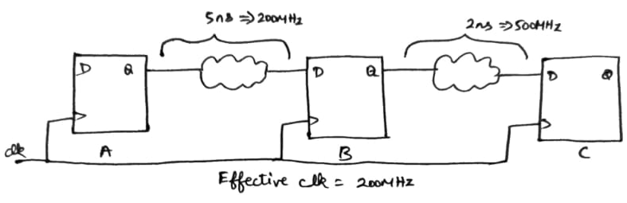

Consider the C-Q delay and set up time is 0ns. The combinational circuits have finite amount of the propagation delay. The maximum clock frequency with which the circuit operates depends on the propagation delay of the combinational logic. From flop A to B the propagation delay is 5ns and the maximum frequency with which this portion of circuit can be operated is 200MHz. Fom flop B to C the propagation delay is 2ns and the maximum frequency with which this portion of circuit can be operated is 500MHz. The effective frequency is minimum of the both which is 200MHz.

Suppose some part of the logic from combinational circuit between flop B and C is placed with the combinational circuit between the flop A and flop B in such a way that the propagation delay of the circuit between flop A and flop is reduced while propagation delay between flop B and flop C is increased by a small amount as show below :


The maximum frequency with which the portion of circuit between A and B can be operated is 250MHz and the maximum frequency with which the portion of circuit between B and C can be operated is 333MHz. The effective frequency is minimum of the both which is 250MHz. Thus the effective maximum frequency has increased after performing the retiming.

### **Illustration of Combinational Optimizsation:**

**Steps to generate the netlist for the below designs**

Generating netlist steps :
```
yosys
read_liberty -lib ../lib/sky130_fd_sc_hd__tt_025C_1v80.lib  
read_verilog <module_name.v> 
synth -top <top_module_name>
# flatten # Use if multiple modules are present
opt_clean -purge
abc -liberty ../lib/sky130_fd_sc_hd__tt_025C_1v80.lib 
show
write_verilog -noattr <netlist_name.v>
```

___
**opt_clean** - remove unused cells and wires. The ***-purge*** switch removes internal nets if they have a public name. This command identifies wires and cells that are unused and removes them.  This command can be used to clean up after the commands that do the actual work.
___

#### **Example 1**
The verilog code for the example 1 is given below :
```
module opt_check (input a , input b , output y);
	assign y = a?b:0;
endmodule
```
The above code infers a multiplexer as shown below :


Since one of the inputs of the multiplexer is always connected to the ground it will infer an AND gate on optimisation.

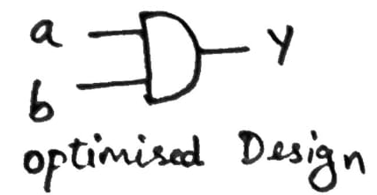

The synthesis result and the netlist are shown below :


#### **Example 2**
The verilog code for the example 2 is given below :
```
module opt_check2 (input a , input b , output y);
	assign y = a?1:b;
endmodule
```
The above code infers a multiplexer as shown below :

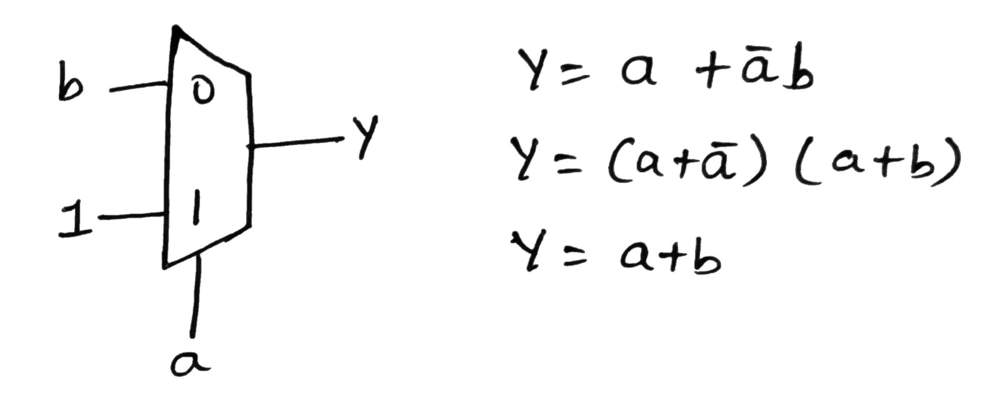

Since one of the inputs of the multiplexer is always connected to the logic 1 it will infer an OR gate on optimisation. The OR gate will be NAND implementation since NOR gate has stacked pmos while NAND implementation has stacked nmos.


The synthesis result and the netlist are shown below :

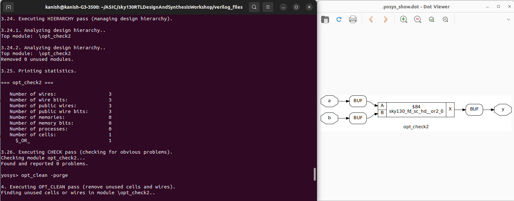


#### **Example 3**
The verilog code for the example 3 is given below :
```
module opt_check3 (input a , input b, input c , output y);
	assign y = a?(c?b:0):0;
endmodule
```
The above code infers two multiplexers as shown below : 

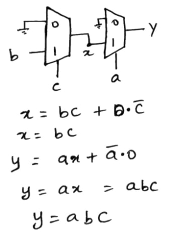

On optimisation the above design becomes a 3 input AND gate as shown below :


The synthesis result and the netlist are shown below :


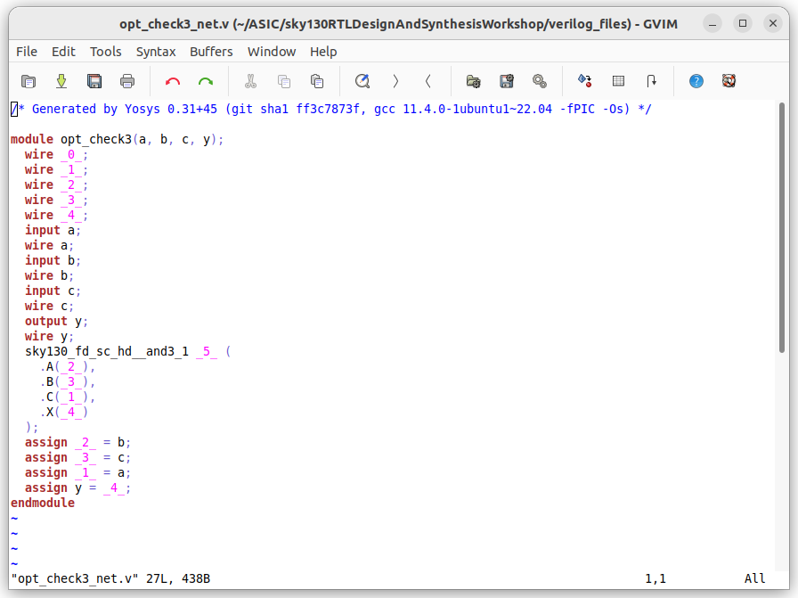


#### **Example 4**
The verilog code for the example 4 is given below :
```
module opt_check3 (input a , input b, input c , output y);
	assign y = a?(c?b:0):0;
endmodule
```
The above code infers two multiplexers as shown below : 


On optimisation the above design becomes a 2 input XNOR gate as shown below :

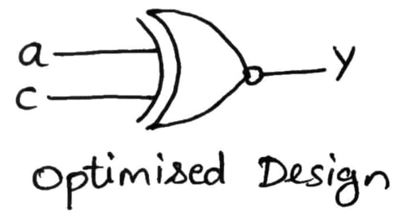

The synthesis result and the netlist are shown below :


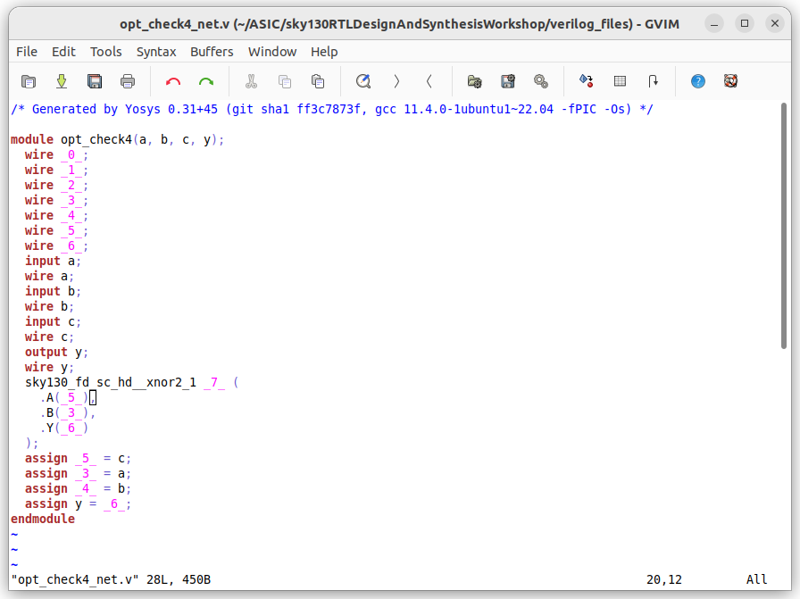

#### **Example 5**
The verilog code for the example 5 is given below :
```
module sub_module1(input a , input b , output y);
 assign y = a & b;
endmodule


module sub_module2(input a , input b , output y);
 assign y = a^b;
endmodule


module multiple_module_opt(input a , input b , input c , input d , output y);
wire n1,n2,n3;

sub_module1 U1 (.a(a) , .b(1'b1) , .y(n1));
sub_module2 U2 (.a(n1), .b(1'b0) , .y(n2));
sub_module2 U3 (.a(b), .b(d) , .y(n3));

assign y = c | (b & n1); 


endmodule
```

The circuit inferred by the code is shown below : 


On optimisation the above design becomes a AND OR gate as shown below :

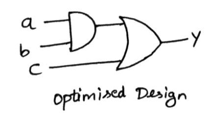

The synthesis result and the netlist are shown below :

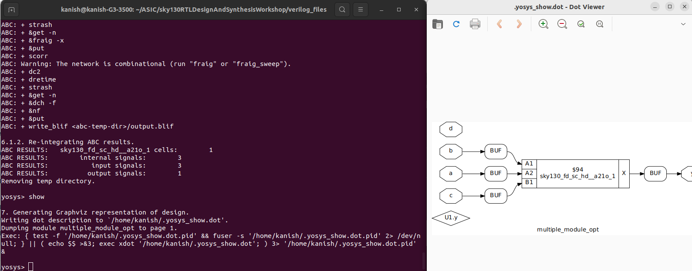

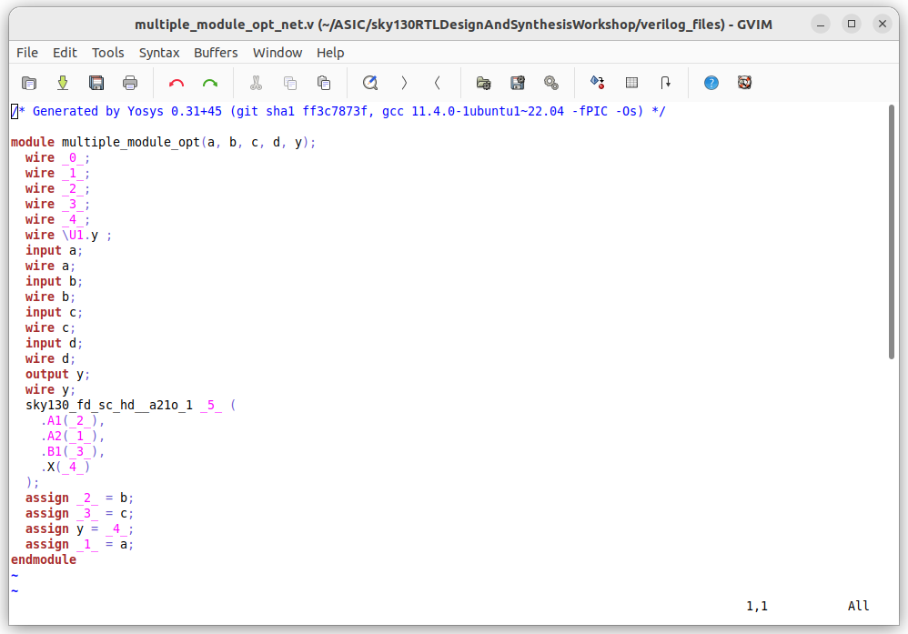


#### **Example 6**
The verilog code for the example 6 is given below :
```
module sub_module(input a , input b , output y);
 assign y = a & b;
endmodule


module multiple_module_opt2(input a , input b , input c , input d , output y);
wire n1,n2,n3;

sub_module U1 (.a(a) , .b(1'b0) , .y(n1));
sub_module U2 (.a(b), .b(c) , .y(n2));
sub_module U3 (.a(n2), .b(d) , .y(n3));
sub_module U4 (.a(n3), .b(n1) , .y(y));


endmodule
```

The circuit inferred by the code is shown below : 

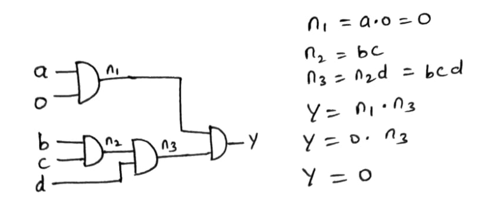

On optimisation the above design becomes a direct connection of ground (logic 0) to output as shown below :


The synthesis result and the netlist are shown below :


### **Illustration of Sequential Optimizsation:**

**Steps to simulate and generate the netlist for the below designs**

Simulation steps :
```
iverilog <rtl_name.v> <tb_name.v>
./a.out
gtkwave <dump_file_name.vcd>
```

Generating netlist steps :
```
yosys
read_liberty -lib ../lib/sky130_fd_sc_hd__tt_025C_1v80.lib  
read_verilog <module_name.v> 
synth -top <top_module_name>
# flatten # use if the multiple modules are present
opt_clean -purge
dfflibmap -liberty ../lib/sky130_fd_sc_hd__tt_025C_1v80.lib 
abc -liberty ../lib/sky130_fd_sc_hd__tt_025C_1v80.lib 
show
write_verilog -noattr <netlist_name.v>
```

#### **Example 1**
The verilog code for the example 1 is given below :
```
module dff_const1(input clk, input reset, output reg q);
always @(posedge clk, posedge reset)
begin
	if(reset)
		q <= 1'b0;
	else
		q <= 1'b1;
end

endmodule
```
The above code infers the circuit as shown below :


Since this code doesn't need optimisation it will infer a D flip-flop with asynchronous reset as shown above.

The simulation, synthesis result and the netlist are shown below :

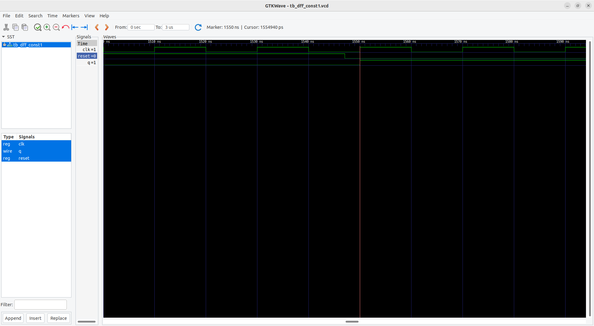

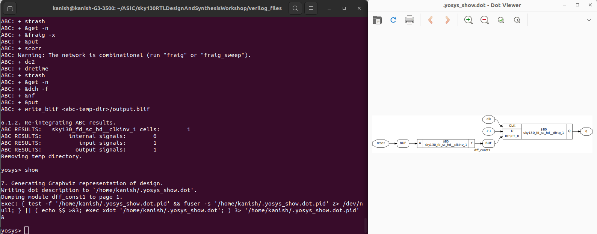


All the standard cells by default have negative logic for reset and since in the code reset is mentioned as positive, an inverter is used for the reset signal. 


#### **Example 2**
The verilog code for the example 2 is given below :
```
module dff_const2(input clk, input reset, output reg q);
always @(posedge clk, posedge reset)
begin
	if(reset)
		q <= 1'b1;
	else
		q <= 1'b1;
end
endmodule
```
The above code infers a D flip-flop with asynchronous set (reset signal is applied to set input) as shown below :


The optimised design infers a direct connection of VDD (logic 1) to the output q as shown below:


The simulation, synthesis result and the netlist are shown below :

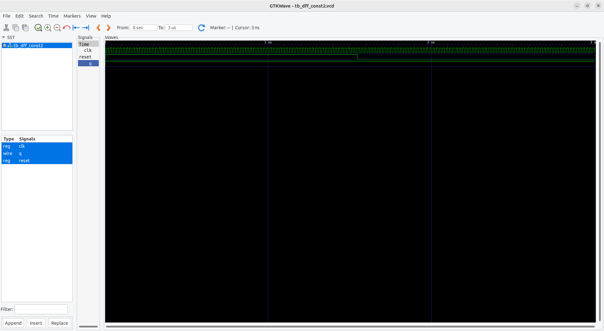


#### **Example 3**
The verilog code for the example 3 is given below :
```
module dff_const3(input clk, input reset, output reg q);
reg q1;

always @(posedge clk, posedge reset)
begin
	if(reset)
	begin
		q <= 1'b1;
		q1 <= 1'b0;
	end
	else
	begin
		q1 <= 1'b1;
		q <= q1;
	end
end

endmodule
```
The above code infers a two D flip-flop with asynchronous set and reset (reset signal is applied to set and reset input) as shown below :

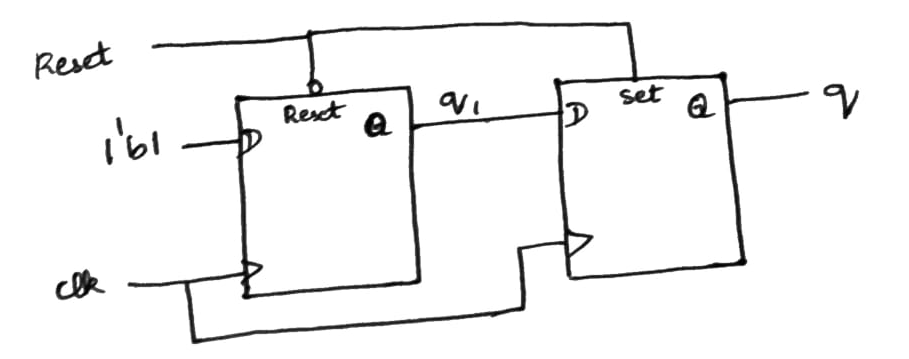

Since this code doesn't need optimisation it will infer two D flip-flop with asynchronous set and reset as shown above.

The simulation, synthesis result and the netlist are shown below :


At the timestamp 1550 the signal q1 changes from 0 to 1 but the output q transits from 1 to 0 for a clock cycle. It is because there will be a finite clock to q delay so the second flip-flop will sample the logic 0 at that rising edge of the clock. Hence there is a change in the output signal for one clock cycle. 


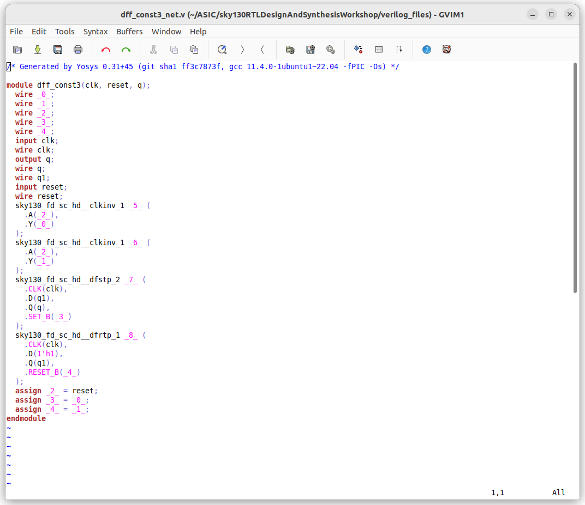


#### **Example 4**
The verilog code for the example 4 is given below :
```
module dff_const4(input clk, input reset, output reg q);
reg q1;

always @(posedge clk, posedge reset)
begin
	if(reset)
	begin
		q <= 1'b1;
		q1 <= 1'b1;
	end
	else
	begin
		q1 <= 1'b1;
		q <= q1;
	end
end

endmodule
```
The above code infers a two D flip-flop with asynchronous set(reset signal is applied to set input ) as shown below :


The optimised design infers a direct connection of VDD (logic 1) to the output q as shown below:
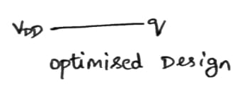

The simulation, synthesis result and the netlist are shown below :

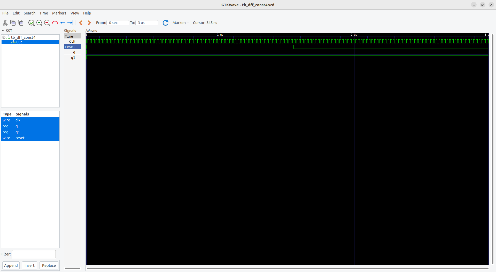
 

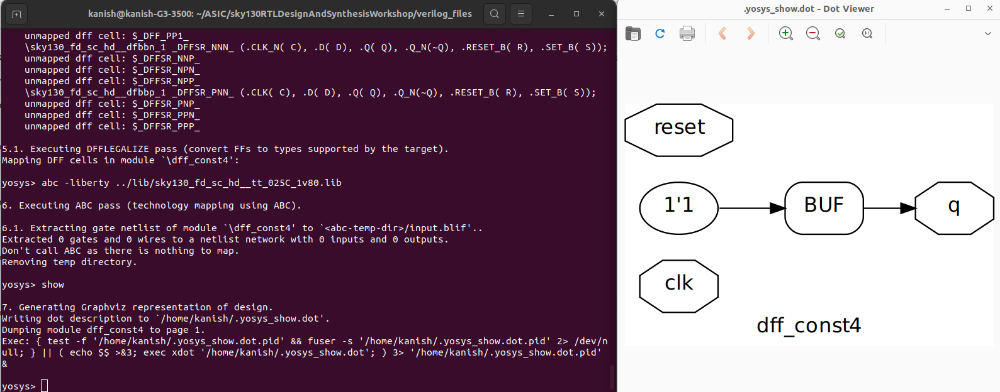


#### **Example 5**
The verilog code for the example 5 is given below :
```
module dff_const5(input clk, input reset, output reg q);
reg q1;

always @(posedge clk, posedge reset)
begin
	if(reset)
	begin
		q <= 1'b0;
		q1 <= 1'b0;
	end
	else
	begin
		q1 <= 1'b1;
		q <= q1;
	end
end

endmodule
```


The above code infers a two D flip-flop with asynchronous reset  as shown below :

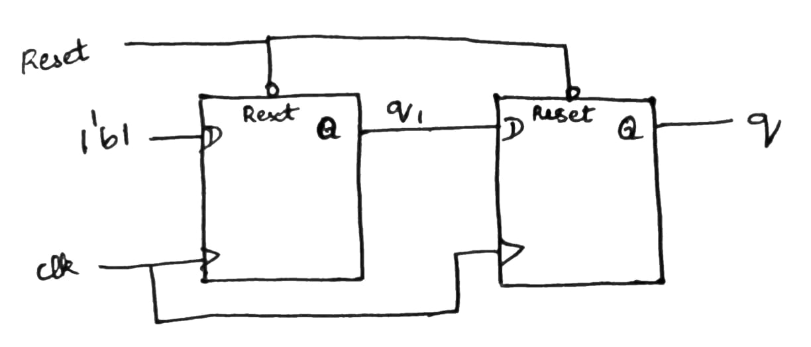

Since this code doesn't need optimisation it will infer two D flip-flop with asynchronous reset as shown above.


The simulation, synthesis result and the netlist are shown below :


 


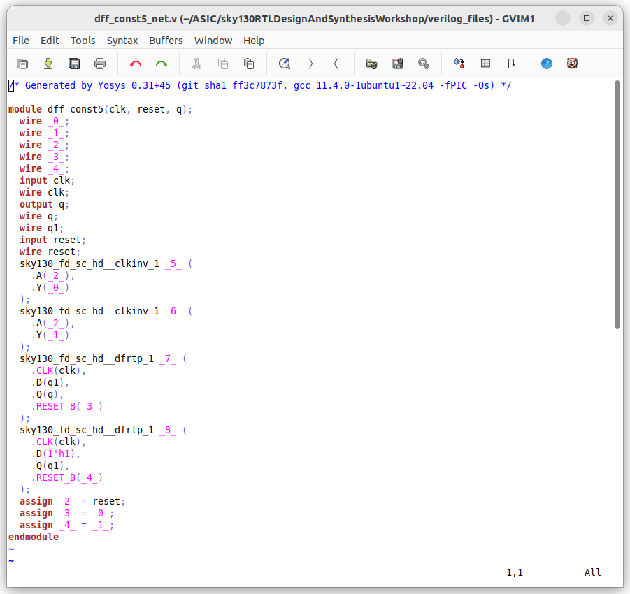


### **Optimisation of Unused States**

**Steps to simulate and generate the netlist for the below designs**

Simulation steps :
```
iverilog <rtl_name.v> <tb_name.v>
./a.out
gtkwave <dump_file_name.vcd>
```

Generating netlist steps :
```
yosys
read_liberty -lib ../lib/sky130_fd_sc_hd__tt_025C_1v80.lib  
read_verilog <module_name.v> 
synth -top <top_module_name>
opt_clean -purge
dfflibmap -liberty ../lib/sky130_fd_sc_hd__tt_025C_1v80.lib 
abc -liberty ../lib/sky130_fd_sc_hd__tt_025C_1v80.lib 
show
write_verilog -noattr <netlist_name.v>
```


Consider the verilog code shown below :
```
module counter_opt (input clk , input reset , output q);
reg [2:0] count;
assign q = count[0];

always @(posedge clk ,posedge reset)
begin
	if(reset)
		count <= 3'b000;
	else
		count <= count + 1;
end

endmodule
```

This verilog code will infer a 3-bit counter with asynchronous reset.
The possible states of the counter are as follows :
| count[2] count[1] count[0]  |COUNT[2] COUNT[1] COUNT[0] |
|:---:|:---:|
| 0 0 0 | 0 0 1  |
| 0 0 1 | 0 1 0 |
| 0 1 0 | 0 1 1 |
| 0 1 1 | 1 0 0 |
| 1 0 0 | 1 0 1 |
| 1 0 1 | 1 1 0 |
| 1 1 0 | 1 1 1 |
| 1 1 1 | 0 0 0 |

where count - Previous count
	  COUNT - Preset count

Since the output q is always assigned COUNT[0]. The other bits of the count are not used and not required. Instead of infering three flip-flops , on optimising the design it will infer a single D flip-flop and an inverter as shown below :

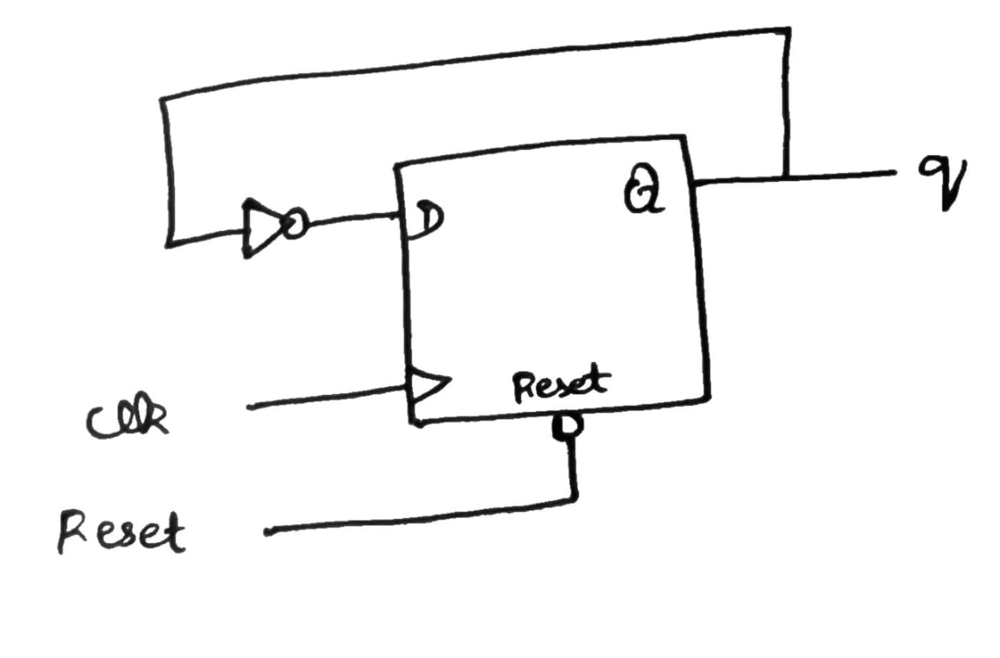

The simulation, synthesis result and the netlist are shown below :


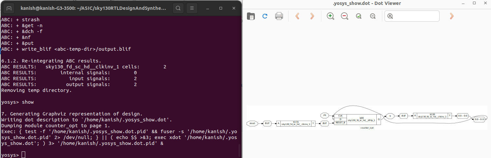

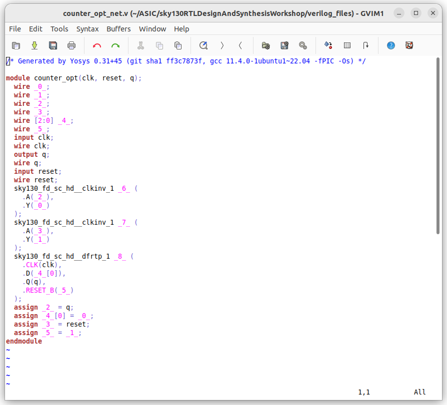


Consider anothet verilog code shown below :
```
module counter_opt (input clk , input reset , output q);
reg [2:0] count;
assign q = count==3'b100;

always @(posedge clk ,posedge reset)
begin
	if(reset)
		count <= 3'b000;
	else
		count <= count + 1;
end

endmodule
```
In this case since q is asserted only when count == 3'b100, all the three flip-flops are used. Hence even after optimisation , the code will infer three flops.

The simulation, synthesis result and the netlist are shown below :

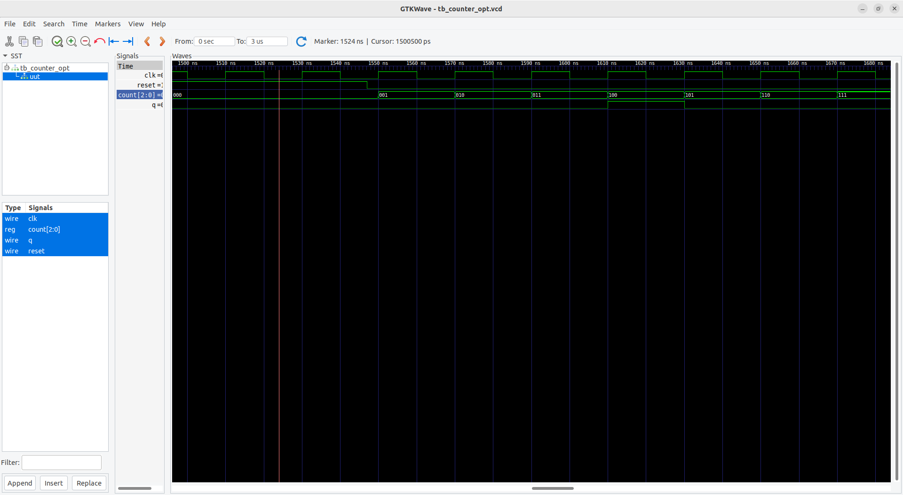


[Reference Section]:#
## References
1.  https://yosyshq.net/yosys/
2.  https://steveicarus.github.io/iverilog/
3.  https://gtkwave.sourceforge.net/
4.  https://ngspice.sourceforge.io/
5.  https://github.com/The-OpenROAD-Project/OpenSTA
6.  http://opencircuitdesign.com/magic/
7.  https://github.com/The-OpenROAD-Project/OpenLane
8.  https://www.eng.biu.ac.il/temanad/digital-vlsi-design/
9.  https://yosyshq.readthedocs.io/projects/yosys/en/latest/cmd_ref.html
10. https://www.youtube.com/watch?v=EczW2IWdnOM
11. https://learn.digilentinc.com/Documents/277
